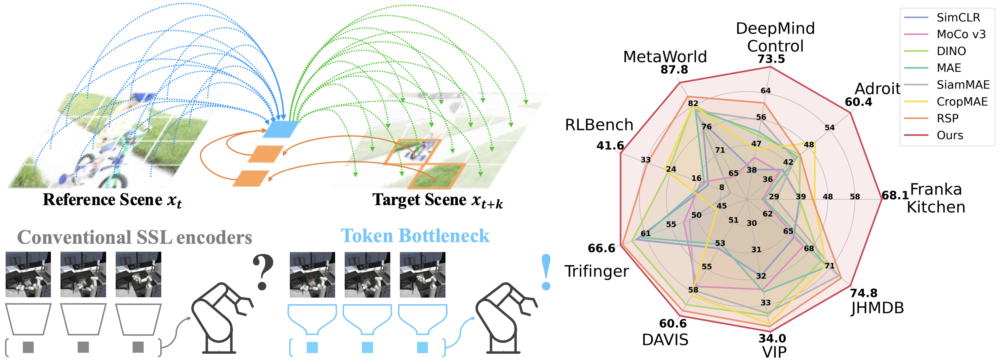

# Token Bottleneck: One Token to Remember Dynamics


> [Taekyung Kim](https://scholar.google.co.kr/citations?user=u-9bdkwAAAAJ&hl=en)<sup>1</sup>, [Dongyoon Han*](https://sites.google.com/site/dyhan0920/)<sup>1</sup>, [Byeongho Heo](https://sites.google.com/view/byeongho-heo/home)<sup>1</sup>, [Jeongeun Park](https://jeongeun-park-page.github.io/)<sup>2</sup>, [Sangdoo Yun](https://sangdooyun.github.io/)<sup>1</sup> <br>
> <sup>1</sup>[NAVER AI LAB](https://naver-career.gitbook.io/en/teams/clova-cic/ai-lab)
> <sup>2</sup>Korea University

[](https://arxiv.org/abs/2507.06543)
[](https://token-bottleneck.github.io/)
[](https://huggingface.co/taekyung-k/tobo_vit_small)


### Abstract
> Deriving compact and temporally aware visual representations from dynamic scenes is essential for successful execution of sequential scene understanding tasks such as visual tracking and robotic manipulation. In this paper, we introduce Token Bottleneck (ToBo), a simple yet intuitive self-supervised learning pipeline that squeezes a scene into a bottleneck token and predicts the subsequent scene using minimal patches as hints. The ToBo pipeline facilitates the learning of sequential scene representations by conservatively encoding the reference scene into a compact bottleneck token during the squeeze step. In the expansion step, we guide the model to capture temporal dynamics by predicting the target scene using the bottleneck token along with few target patches as hints. This design encourages the vision backbone to embed temporal dependencies, thereby enabling understanding of dynamic transitions across scenes. Extensive experiments in diverse sequential tasks, including video label propagation and robot manipulation in simulated environments demonstrate the superiority of ToBo over baselines. Moreover, deploying our pre-trained model on physical robots confirms its robustness and effectiveness in real-world environments. We further validate the scalability of ToBo across different model scales.


## ✨ Highlights
### Token bottleneck enables conservative scene summarization that effectively captures temporal dynamics




## 🚀 Contents
- [Install](#install)
- [Model Zoo](docs/Model_zoo.md)
- [Dataset](docs/Data.md)
- [Train](docs/Train.md)
- [Evaluation](#evaluation)
- [License](#license)
- [Citation](#citation)

## 📍Install

* Our environments are based on the *nvcr.io/nvidia/pytorch:21.10-py3* docker image. 
* To get started, you may install [PyTorch](https://pytorch.org/get-started/previous-versions/) using the following command:
```
conda install pytorch==1.10.0 torchvision==0.11.0 torchaudio==0.10.0 cudatoolkit=11.3 -c pytorch -c conda-forge
```

1. Clone this repository and navigate to SE-MAE folder
```bash
git clone {repo}.git
cd Token-Bottleneck
```

2. Install Package
```
pip instail timm==0.4.12
pip install decord==0.6.0
pip install tensorboardX
pip install pandas
pip install scikit-image
```

## 📍Dataset
We pre-train our ToBo models on Kinetics-400. The samples are located in the following structure:
```
|-- train
    |-- abseiling
        |-- xx.mp4
        |-- ...
    |-- air_drumming
        |-- xx.mp4
        |-- ...
    |-- ...
```

## 📍Train
We provide an example pre-training command in [Train.md](docs/Train.md)

## 📍Evaluation
### Video Label Propagation
We evaluate our model on three video label propagation benchmarks: DAVIS, JHMDB, and VIP.
Please refer to the evaluation code in [alexandre-eymael/CropMAE](https://github.com/alexandre-eymael/CropMAE). 

### Robotics tasks
We evaluate our model on three robotics benchmarks: FrankaKitchen, CortexBench, and RLBench. Please refer to the following repositories for each benchmark:
* FrankaKitchen: [facebookresearch/r3m](https://github.com/facebookresearch/r3m)
* CortecBench: [facebookresearch/eai-vc](https://github.com/facebookresearch/eai-vc)
* RLBench: [stepjam/RLBench](https://github.com/stepjam/RLBench), [stepjam/ARM](https://github.com/stepjam/ARM)


## Acknowledgements
This project is built upon [RSP](https://github.com/huiwon-jang/RSP). We sincerely thank the authors for these greate codebases.


## License
```
Token Bottleneck
Copyright (c) 2025-present NAVER Cloud Corp.
CC BY-NC 4.0 (https://creativecommons.org/licenses/by-nc/4.0/) 
```


## Citation

If you find Token Bottleneck useful for your research and applications, please cite using this BibTeX:
```bibtex
@article{kim2025tobo,
  title={Token Bottleneck: One Token to Remember Dynamics},
  author={Kim, Taekyung and Han, Dongyoon and Heo, Byeongho and Park, Jeongeun and Yun, Sangdoo},
  booktitle={arXiv preprint arXiv:2507.06543},
  year={2025},
}
```
